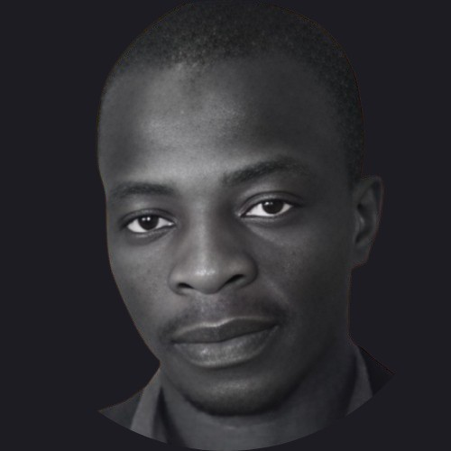

# 👋 Hi, I'm Zak 

AI/ML Engineer with a strong foundation in Computer Science and Mathematics, passionate about developing data-driven solutions and machine learning applications.

## About Me

I am an aspiring AI/ML Engineer with a solid background in software development and machine learning. My academic foundation in Computer Science and Mathematics, combined with hands-on experience in ML frameworks and deep learning, positions me to contribute effectively to AI-driven projects. I focus on implementing machine learning solutions while maintaining software engineering best practices. Currently seeking entry-level opportunities where I can apply my ML expertise and continue growing as an AI engineer.

## Technical Skills 🛠️

**Machine Learning & AI:**
- Frameworks: TensorFlow, PyTorch, scikit-learn
- Areas: Natural Language Processing, Deep Learning
- Tools: Jupyter, NumPy, Pandas, Matplotlib

**Software Development:**
- Languages: Python, C++, JavaScript
- Web Frameworks: Flask, React, HTML, CSS
- Tools: Git, Docker, AWS
- Databases: PostgreSQL, MySQL

## Key Projects 🔬

### Coming soon

<!-- ### Project Name 1
- Description of your ML project
- Technologies used: PyTorch, scikit-learn, etc.
- Link to repository

### Project Name 2
- Description of your ML project
- Technologies used: TensorFlow, Keras, etc.
- Link to repository

### Project Name 3
- Description of your ML project
- Technologies used: List relevant technologies
- Link to repository -->

## Certifications & Education 📚

**Education:**
- Bachelor of Science in Computer Science, Minor in Mathematics | Penn State University
- Associate of Science in Computer Science | Community College of Philadelphia

**Relevant Certifications:**
- AI programming with Python Nanodegree Professional Certificate - Udacity
- Generative AI for Software Development professional Certificate - DeepLearning.AI
- Natural Language Processing Specialization - DeepLearning.AI
- Deep Learning Specialization - Stanford University & DeepLearning.AI
- Machine Learning Specialization - Stanford University & DeepLearning.AI
- Mathematics for Machine Learning and Data Science - DeepLearning.AI
- C Programming with Linux - Dartmouth College, Institut Mines-Télécom
- Frontend career path - Scrimba

## Professional Development 🎯

- Actively implementing ML models using PyTorch and TensorFlow
- Developing expertise in NLP and computer vision applications
- Contributing to open-source ML projects
- Studying advanced ML concepts and keeping up with latest research

## Leadership & Professional Affiliations 🌟

- Member, Association for Computing Machinery (ACM)
- Member, Upsilon Pi Epsilon (International Honor Society for Computing Sciences)
- Member, PHI Phi Theta Kappa

## Let's Connect! 📫

I'm actively seeking entry-level AI/ML Engineering positions and always eager to collaborate on innovative machine learning projects.

  

  

  

  

---

*Currently working on: Building a comprehensive ML project portfolio focused on practical applications of deep learning.*
