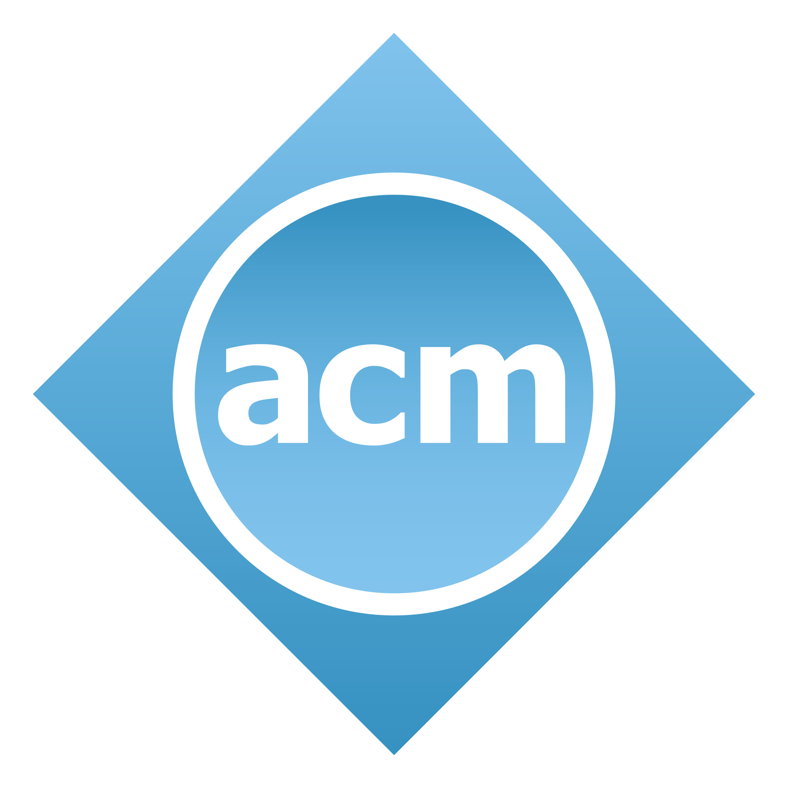
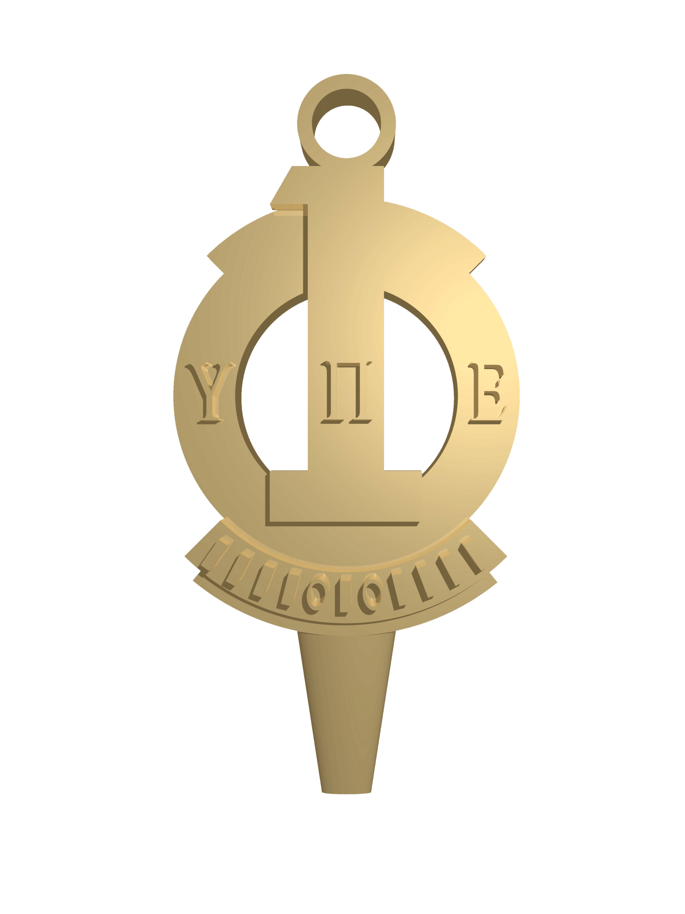

   

# Hi there!  I'm Zakaria Coulibaly.
## A Full Stack Software Engineer | Meticulous Problem Solver | Lifelong Learner.
### About Me 🙋🏽‍♂️ ----------->
A dedicated software engineer with a profound passion for software engineering, artificial intelligence, and its integral subset, machine learning. I believe in harnessing the synergy of these disciplines to drive transformative solutions and make significant contributions to the industry.

### My Motto 🌟
"Code with passion, innovate with purpose, and never stop learning – every challenge is a stepping stone to success." 
This personal mantra guides my approach to software engineering, where each line of code is not just a task, but a step towards mastering the art of problem-solving and creating impactful solutions.

### Education 📚 ----------->
- **Bachelor of Science in Computer Science with a Minor in Mathematics** (Expected May 2024) | Penn State, Harrisburg, PA
- **Associate of Science in Computer Science** | Community College of Philadelphia, PA

### Technical Skills 💻 ----------->

- **Web/Media**:        
- **Backend**:    
- **Mobile**:   
- **Programming Languages**:        
- **Databases**:     
- **Other Skills**: REST API design and building, Version Control with  and 
- **Operating Systems**:   
- **IDEs**:      
- **Cloud**:    

### Projects 🚀 --------------->
_Coming Soon - Stay tuned for some exciting projects I'm working on!_

### Certifications 🏅 ------------>
- Frontend Developer career path, Scrimba, June 2022.
- Data structures and software design, Edx, Jun 2020.
- OOP Java, Codewithmosh, Dec 2019.
- C++, Codewithmosh, Oct 2023.
- Mastering Next.js 13 with TypeScript, Codewithmosh, Oct 2023.
- Version Control Git, Coursera, Aug 2023.
- React 

### Leadership & Recognition 🌟 ---------->

  
   **NSLS National Society of Leadership and Success**: Advanced Leadership Certification.

  
   ** NSLS National Society of Leadership and Success member**: Orientation and Leadership Training Certificate.

  
   **ACM Member**: Engaging in the computing community at a professional level.

  
  **UPE Upsilon Pi Epsilon member**: Recognized for academic and leadership potential.

### Statistics ⚡️ -------------->

 

### Let's Connect 🤝 ----------->

    
    
    
    
    
    
    
    

Feel free to reach out for collaborations, learning opportunities, or just for a chat about technology and innovation!
