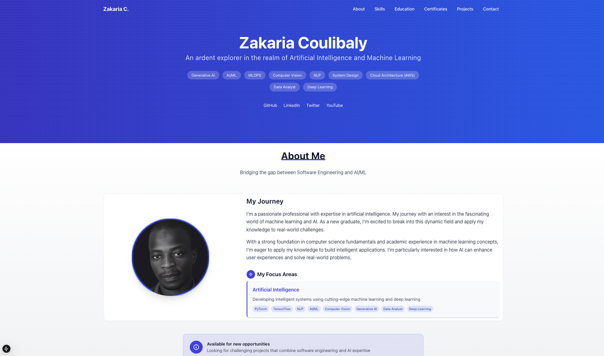

# 👋 Hi, I'm Zak
> An AI/ML Enthusiast & Practitioner

This portfolio is under development

## 🔭 Portfolio Focus
### 🤖 AI/ML
- Machine Learning (PyTorch, scikit-learn, TensorFlow)
- Deep Learning & Computer Vision
- Natural Language Processing 

## 🛠️ Tech Stack

## 🌐 Let's Connect

---
