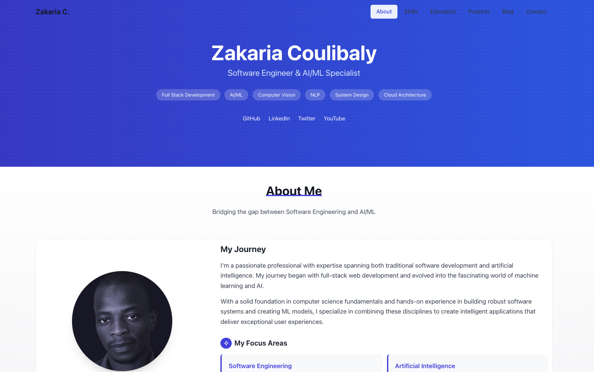

# 👋 Hi, I'm Zak

> A Software Engineer & AI/ML Enthusiast

<a href="https://codemon.io">My portfolio</a>

This portfolio is under development

[

## 🔭 Portfolio Areas

### 💻 Software Engineering 
- Full-stack development with JavaScript & React
- System design & API Development
- DevOps & Cloud (AWS)

### 🤖 AI/ML
- Machine Learning (PyTorch, scikit-learn)
- Deep Learning & Computer Vision
- Natural Language Processing 

## 🛠️ Tech Stack

## 🌐 Let's Connect

---
